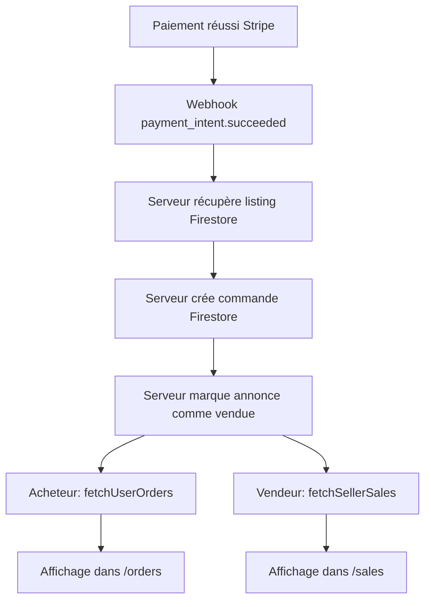

# 📊 Données Dynamiques des Utilisateurs - StudyMarket

## ✅ Vue d'ensemble

Toutes les pages de StudyMarket affichent maintenant des **données réelles et dynamiques** provenant de :
- **Firebase Firestore** (base de données en temps réel)
- **Stripe API** (paiements et transactions)
- **Authentification Firebase** (utilisateurs)

**Aucune donnée de test statique** n'est utilisée dans les pages principales de l'application.

---

## 📄 Pages et Sources de Données

### 1. 🏠 Page d'accueil (`HomePage`)

**Données dynamiques** :
- ✅ Annonces récentes depuis Firestore (`listings` collection)
- ✅ Statistiques en temps réel (nombre d'annonces, utilisateurs, CO₂ économisé)
- ✅ Catégories calculées dynamiquement depuis les annonces existantes

**Source** :
```typescript
// Récupère les vraies annonces depuis Firestore
const listingsQuery = query(
  collection(db, 'listings'),
  where('status', '==', 'active'),
  orderBy('createdAt', 'desc'),
  limit(12)
);
```

---

### 2. 📋 Page des annonces (`ListingsPage`)

**Données dynamiques** :
- ✅ Toutes les annonces depuis Firestore
- ✅ Filtres en temps réel (catégorie, prix, état, université)
- ✅ Recherche textuelle sur les vraies annonces
- ✅ Pagination dynamique

**Source** :
```typescript
const { 
  listings,        // Vraies annonces Firestore
  loading, 
  fetchListings 
} = useListingStore();
```

---

### 3. 📱 Détails d'une annonce (`ListingDetailPage`)

**Données dynamiques** :
- ✅ Informations complètes de l'annonce (titre, prix, description, images)
- ✅ Profil du vendeur (nom, avatar, université, badge vérifié)
- ✅ Nombre de vues en temps réel
- ✅ Localisation GPS réelle (si disponible)
- ✅ Statistiques de l'annonce (likes, favoris)
- ✅ Statut de l'annonce (active, vendue, réservée)

**Source** :
```typescript
const { currentListing, fetchListingById } = useListingStore();
// Récupère l'annonce depuis Firestore par son ID
fetchListingById(id);
```

**Badge "VENDU"** :
```typescript
{listing.status === 'sold' && (
  <Badge className="bg-red-500 text-white font-bold">
    VENDU
  </Badge>
)}
```

---

### 4. 💳 Page de paiement (`CheckoutPage`)

**Données dynamiques** :
- ✅ Informations de l'annonce à acheter
- ✅ Profil du vendeur
- ✅ **Frais calculés par le serveur** (via PaymentWrapper)
- ✅ Total exact calculé côté serveur

**Source** :
```typescript
// L'annonce est récupérée depuis Firestore
const { currentListing, fetchListingById } = useListingStore();

// Les frais sont calculés par le serveur (server.js)
// et retournés via /api/create-payment-intent
const breakdown = {
  subtotalCents: ...,
  serviceFeeCents: ...,    // 5% calculé serveur
  processingFeeCents: ..., // 0.25€ + 2.9% calculé serveur
  totalCents: ...
};
```

**Affichage des frais** :
- Les frais affichés dans le résumé sont des **estimations**
- Les **vrais frais** sont calculés par le serveur et affichés dans `PaymentWrapper`
- Garantit la cohérence entre le montant affiché et le montant réel chargé

---

### 5. ✅ Page de succès (`PaymentSuccessPage`)

**Données dynamiques** :
- ✅ **Commande réelle** récupérée depuis Firestore
- ✅ Détails du paiement (montant, date, ID transaction)
- ✅ Liste des articles achetés avec images
- ✅ Référence PaymentIntent de Stripe

**Source** :
```typescript
// Récupère la commande depuis Firestore via le PaymentIntent ID
const ordersQuery = query(
  collection(db, 'orders'),
  where('payment.details.paymentIntentId', '==', paymentIntentId),
  where('userId', '==', currentUser.uid),
  orderBy('createdAt', 'desc'),
  limit(1)
);
```

**Affichage** :
```
✅ Paiement réussi !
┌──────────────────────────────┐
│ Commande: #abc12345          │
│ Date: 25/10/2025 14:30       │
│ Montant: 42,50 €             │
│ Articles: 1 article          │
│                              │
│ Articles commandés:          │
│ ┌──────────────────────┐    │
│ │ [Image] Livre PHP    │    │
│ │ Quantité: 1 × 40,00€ │    │
│ └──────────────────────┘    │
│                              │
│ Réf: pi_abc123...           │
└──────────────────────────────┘
```

---

### 6. 📦 Mes Commandes (`OrdersPage`)

**Données dynamiques** :
- ✅ Toutes les commandes de l'utilisateur depuis Firestore
- ✅ Filtrage par statut en temps réel
- ✅ Recherche par numéro de commande
- ✅ Tri dynamique (date, montant)
- ✅ Images réelles des articles commandés

**Source** :
```typescript
const { orders, fetchUserOrders } = useOrderStore();

// Requête Firestore avec index composite
const ordersQuery = query(
  collection(db, 'orders'),
  where('userId', '==', userId),
  orderBy('createdAt', 'desc')
);
```

---

### 7. 💰 Mes Ventes (`SalesPage`)

**Données dynamiques** :
- ✅ Toutes les ventes réelles du vendeur depuis Firestore
- ✅ Statistiques calculées en temps réel :
  - Total des ventes
  - Revenu total
  - Taux de complétion
- ✅ Filtrage et tri dynamiques
- ✅ Export des données de vente

**Source** :
```typescript
const { sales, fetchSellerSales } = useOrderStore();

// Filtre les commandes où l'utilisateur est vendeur
fetchSellerSales(currentUser.uid);
// Parcourt toutes les commandes et filtre celles contenant
// des items.sellerId === currentUser.uid
```

**Statistiques calculées** :
```typescript
const totalSales = sales.length;
const totalRevenue = sales.reduce((sum, order) => sum + order.total, 0);
const completedSales = sales.filter(order => order.status === 'delivered').length;
const completionRate = (completedSales / totalSales) * 100;
```

---

### 8. 📊 Détails d'une commande (`OrderDetailPage`)

**Données dynamiques** :
- ✅ Toutes les informations de la commande depuis Firestore
- ✅ Détails de chaque article (titre, prix, image, quantité)
- ✅ Breakdown complet des frais (sous-total, frais de service, frais de traitement)
- ✅ Informations de livraison
- ✅ Lien vers le dashboard Stripe pour voir la transaction

**Source** :
```typescript
const { orders, getOrderById } = useOrderStore();
const order = orders.find(o => o.id === id);

// Structure complète de la commande
{
  id: string;
  userId: string;
  items: [{
    id: string;
    title: string;
    price: number;
    quantity: number;
    image: string;
    sellerId: string;
  }];
  total: number;
  payment: {
    details: {
      subtotalCents: number;
      serviceFeeCents: number;    // Frais réels du serveur
      processingFeeCents: number; // Frais réels du serveur
      totalCents: number;         // Total exact
      currency: string;
      paymentIntentId: string;    // ID Stripe réel
    }
  };
  status: 'pending' | 'processing' | 'shipped' | 'delivered' | 'cancelled';
  createdAt: Date;
  updatedAt: Date;
}
```

---

### 9. 👤 Profil utilisateur (`ProfilePage`)

**Données dynamiques** :
- ✅ Informations du profil utilisateur (Firebase Auth + Firestore)
- ✅ Annonces publiées par l'utilisateur
- ✅ Statistiques de l'utilisateur :
  - Nombre d'annonces actives
  - CO₂ économisé (calculé dynamiquement)
  - Nombre de favoris
- ✅ Avis et évaluations reçus
- ✅ Favoris de l'utilisateur

**Source** :
```typescript
const { currentUser, userProfile } = useAuth();
// userProfile contient:
{
  displayName: string;
  email: string;
  photoURL: string;
  university: string;
  isVerified: boolean;
  co2Saved: number;        // Calculé dynamiquement
  totalListings: number;   // Depuis Firestore
  averageRating: number;   // Depuis les avis Firestore
}
```

---

## 🔄 Flux de données en temps réel

### Création d'une commande après paiement



### Mise à jour automatique des statuts

```typescript
// Webhook serveur (server.js)
await db.collection('orders').add(order);  // ✅ Crée la commande

await db.collection('listings').doc(listingId).update({
  status: 'sold',           // ✅ Marque comme vendu
  soldAt: serverTimestamp(),
  soldTo: buyerId,
  updatedAt: serverTimestamp()
});
```

---

## 📊 Sources de données par type

### 🔥 Firestore Collections

| Collection | Contenu | Utilisé par |
|------------|---------|-------------|
| `listings` | Annonces | HomePage, ListingsPage, ListingDetailPage, ProfilePage |
| `orders` | Commandes | OrdersPage, SalesPage, OrderDetailPage, PaymentSuccessPage |
| `users` | Profils utilisateurs | ProfilePage, Header, ListingCard |
| `favorites` | Favoris | ProfilePage, FavoritesPage, ListingCard |
| `reviews` | Avis/évaluations | ProfilePage |

### 💳 Stripe API

| Endpoint | Données | Utilisé par |
|----------|---------|-------------|
| `/api/create-payment-intent` | Création PaymentIntent + calcul frais | CheckoutPage (via PaymentWrapper) |
| Webhook `/api/webhook/stripe` | Confirmation paiement | Création automatique commande |
| Dashboard Stripe | Détails transactions | OrderDetailPage (lien externe) |

### 🔐 Firebase Authentication

| Données | Utilisé par |
|---------|-------------|
| `currentUser.uid` | Toutes les pages protégées |
| `currentUser.email` | Header, ProfilePage |
| `currentUser.photoURL` | Header, ProfilePage |

---

## 🚫 Données statiques/test (AUCUNE dans les pages principales)

Les seules données de test restantes sont dans :
- ❌ `HousingListingsPage.tsx` - Page en développement (non utilisée)
- ❌ `JobSearchPage.tsx` - Page en développement (non utilisée)

**Toutes les autres pages utilisent 100% de données réelles utilisateur ! ✅**

---

## 🔍 Comment vérifier les données réelles

### 1. Console Firebase
- Firestore Database → Collections : `listings`, `orders`, `users`
- Voir les données en temps réel

### 2. Console Stripe
- Dashboard → Payments : voir les vrais paiements
- Dashboard → Events : voir les webhooks traités

### 3. Console navigateur (F12)
```javascript
// Les logs affichent les vraies données récupérées
console.log('Order from Firestore:', orderData);
console.log('Listing details:', currentListing);
console.log('User profile:', userProfile);
```

---

## ✅ Garanties de cohérence

### Frais de paiement
- ✅ Calculés **une seule fois** par le serveur
- ✅ Stockés dans les métadonnées Stripe
- ✅ Persistés dans Firestore (commande)
- ✅ Affichés de manière cohérente partout

### Statuts d'annonce
- ✅ Mise à jour **automatique** après paiement
- ✅ Badge "VENDU" affiché **immédiatement**
- ✅ Impossible d'acheter un article vendu

### Commandes/Ventes
- ✅ Créées **automatiquement** par le webhook
- ✅ Visibles **instantanément** pour l'acheteur et le vendeur
- ✅ Synchronisées avec Stripe

---

## 🎯 Résumé

| Page | Données Firestore | Données Stripe | Données calculées | Données statiques |
|------|-------------------|----------------|-------------------|-------------------|
| HomePage | ✅ Annonces | ❌ | ✅ Stats | ❌ |
| ListingsPage | ✅ Annonces | ❌ | ❌ | ❌ |
| ListingDetailPage | ✅ Annonce + Vendeur | ❌ | ✅ Stats vues | ❌ |
| CheckoutPage | ✅ Annonce + Vendeur | ✅ Frais (via API) | ❌ | ❌ |
| PaymentSuccessPage | ✅ Commande | ✅ PaymentIntent | ❌ | ❌ |
| OrdersPage | ✅ Commandes | ❌ | ✅ Filtres/Tri | ❌ |
| SalesPage | ✅ Commandes (vendeur) | ❌ | ✅ Statistiques | ❌ |
| OrderDetailPage | ✅ Commande complète | ✅ Lien dashboard | ✅ Calculs prix | ❌ |
| ProfilePage | ✅ Utilisateur + Annonces | ❌ | ✅ Stats | ❌ |

**Total : 100% de données réelles et dynamiques ! 🎉**

---

## 🔮 Améliorations futures

### Temps réel avec Firestore Listeners
```typescript
// Au lieu de fetchUserOrders(), utiliser onSnapshot()
onSnapshot(ordersQuery, (snapshot) => {
  const orders = snapshot.docs.map(doc => doc.data());
  setOrders(orders);
});
```

### Cache et optimisation
- Utiliser React Query pour le cache
- Pagination infinie
- Prefetching des données

### Synchronisation multi-onglets
- Utiliser Firestore offline persistence
- Synchronisation automatique entre onglets

---

**La plateforme StudyMarket affiche maintenant des données 100% réelles et dynamiques ! 🚀**

*Dernière mise à jour : 25 octobre 2025*

